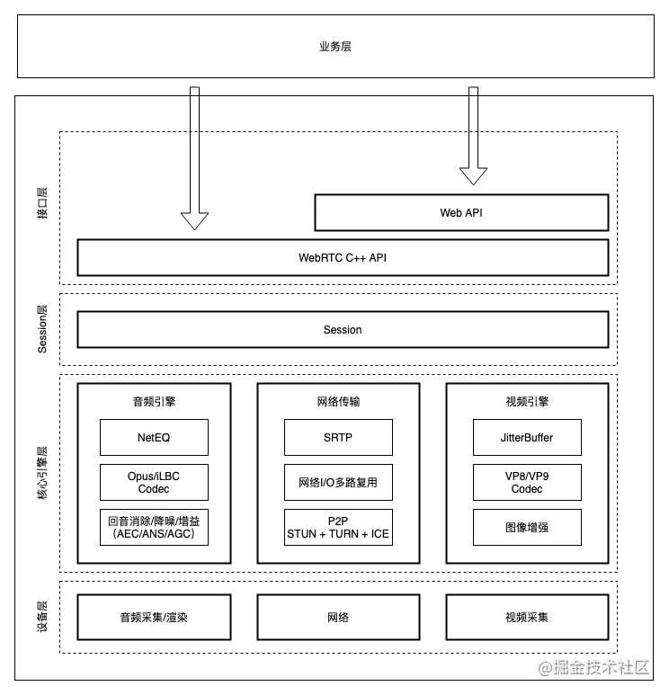
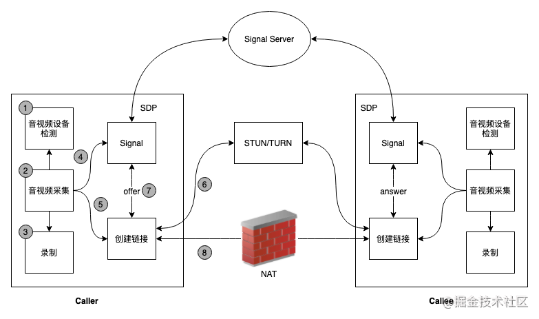
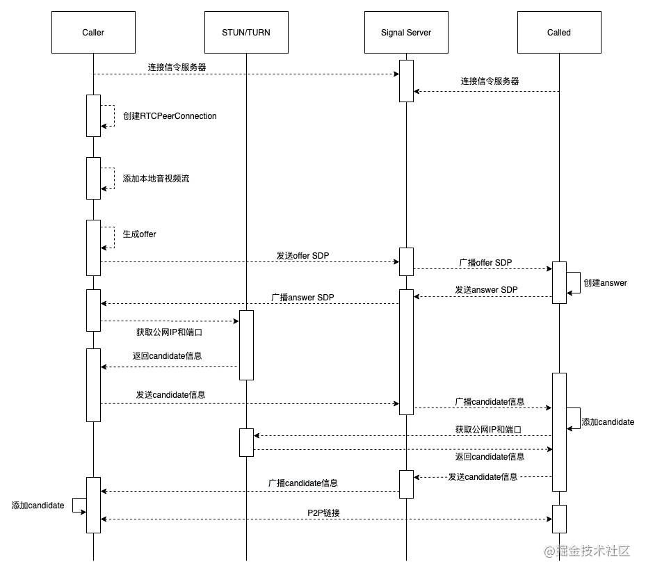
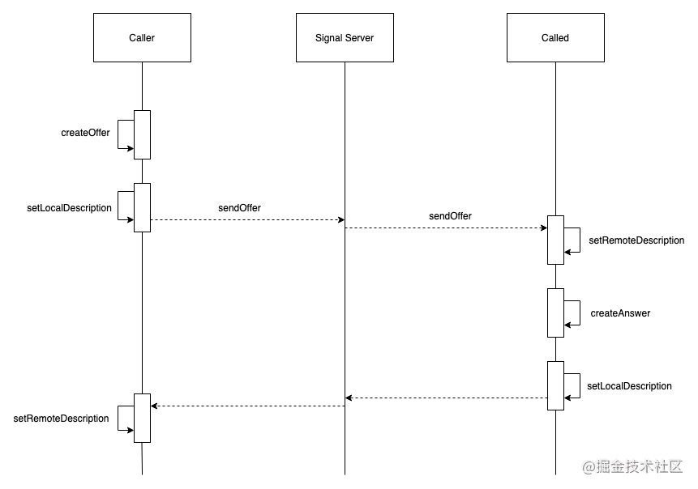

### 学习资料

### RTC

- video
  
[RTC技术简介](https://www.bilibili.com/video/BV1jX4y137KM?spm_id_from=333.337.search-card.all.click&vd_source=3c71e3397ca331aa190dd5e2f3a7c122)


***
### WebRTC
- video 

[WebRTC手写实现腾讯QQ实时音视频通话技术](https://www.bilibili.com/video/BV1VK4y1N7EN/?p=2&spm_id_from=pageDriver&vd_source=3c71e3397ca331aa190dd5e2f3a7c122)

[WebRTC对等连接方式](https://www.bilibili.com/video/BV1Dr4y1S7Xx/?spm_id_from=333.788&vd_source=3c71e3397ca331aa190dd5e2f3a7c122)

[WebRTC通信工作流程](https://www.bilibili.com/video/BV1Qq4y1q77m/?spm_id_from=333.788&vd_source=3c71e3397ca331aa190dd5e2f3a7c122)


- doc  

[WebRtc C++ API 开发学习记录](https://github.com/HATTER-LONG/NoteBook_WebRtcLearning)

[WebRTC 源码学习](https://github.com/elesos/webrtc)

[WebRTC-Architecture](https://webrtc.github.io/webrtc-org/architecture/)

[google webrtc source code](https://chromium.googlesource.com/external/webrtc)

[Windows平台WebRTC编译](https://blog.jianchihu.net/windows-webrtc-build.html)

[WebRTC 1.0: Real-Time Communication Between Browsers](https://w3c.github.io/webrtc-pc/)

[WebRTC浅析与实战](https://davidchen93.blog.csdn.net/article/details/120067269?spm=1001.2101.3001.6650.2&utm_medium=distribute.pc_relevant.none-task-blog-2%7Edefault%7ECTRLIST%7ERate-2-120067269-blog-6947101.pc_relevant_multi_platform_featuressortv2dupreplace&depth_1-utm_source=distribute.pc_relevant.none-task-blog-2%7Edefault%7ECTRLIST%7ERate-2-120067269-blog-6947101.pc_relevant_multi_platform_featuressortv2dupreplace&utm_relevant_index=3)

[搞定WebRTC音视频直播通信技术（核心技术精讲篇）](https://www.cnblogs.com/rajan/p/12308606.html)

[WebRTC TURN协议初识及turnserver实践](https://zhuanlan.zhihu.com/p/71025431)

- 环境搭建

[WebRTC环境搭建-声网](https://webrtc.org.cn/mirror/)


- open code

[开源STUN和TURN服务器](http://webrtcbook.com/turnserver/)

***

### RTC

- 标准RTC建联过程

1. SDP交互
   协商通信双方的媒体信息，如双方采用什么编码格式
2. ICE探测
   借助STUN、TURN探测双方是否可以P2P直连
3. DTLS
   交互RTP加密的密钥信息
4. SRTP对RTP进行加密

- 标准RTC交互时序图

1. sdp:媒体协商
2. stun:探测媒体地址
3. dtls:交互密钥
4. srtp:流加密
   

### WebRTC
- 简要
WebRTC是浏览器支持的协议，使用户可以跳过服务器，直接进行点对点的传输而不需要一个服务器的转发。
WebRTC使用STUN服务器将NAT地址转化为公网路径，用户间再使用TURN服务器进行中继。
WebRTC基于UDP，因而有低延迟但会丢包的特点，特别适合网络视频，丢掉某一帧并不会对视频有太大影响

- sdp
```
会话元：v o t
网络描述：c candidate
流描述：m
安全描述：a
服务质量：
```

- 会话描述协议SDP
```
Session description
    v=  (protocol version)
    o=  (originator and session identifier)
    s=  (session name)
    i=* (session information)
    u=* (URI of description)
    e=* (email address)
    p=* (phone number)
    c=* (connection information -- not required if included in all media)
    b=* (zero or more bandwidth information lines)
    [...One or more time descriptions ("t=" and "r=" lines)]
    z=* (time zone adjustments)
    k=* (encryption key)
    a=* (zero or more session attribute lines)
    [...Zero or more media descriptions]

Time description
    t=  (time the session is active)
    r=* (zero or more repeat times)

Media description, if present
    m=  (media name and transport address)
    i=* (media title)
    c=* (connection information -- optional if included at session level)
    b=* (zero or more bandwidth information lines)
    k=* (encryption key)
    a=* (zero or more media attribute lines)
```
- sdp example
```
v=0
o=jdoe 2890844526 2890842807 IN IP4 10.47.16.5
s=SDP Seminar
i=A Seminar on the session description protocol
u=[http://www.example.com/seminars/sdp.pdf](http://www.example.com/seminars/sdp.pdf)
[e](mailto:e=j.doe@example.com)[=j.doe@example.com](mailto:e=j.doe@example.com) (Jane Doe)
c=IN IP4 224.2.17.12/127
t=2873397496 2873404696
a=recvonly
m=audio 49170 RTP/AVP 0
m=video 51372 RTP/AVP 99
a=rtpmap:99 h263-1998/90000
```


```
1. 媒体协商
2. 连通性收集与处理
3. 传输
```

- 信令的作用
```
1. 协商媒体功能和设置
2. 标识和验证会话参与者的身份
3. 控制媒体会话、指示进度、更改会话和终止会话
4. 当会话双方同时尝试建立或更改会话时，实施双专用分解（Glare Resolution）
```

***

- WebRTC通信流程


- WebRTC通信流程


- WebRTC通信流程


- WebRTC-framework


- WebRTC-connect-process


>> 通常音视频通信架构如上图所示，通信双方分部是caller（主叫）与callee（被叫），两边的内部逻辑相似，下面以caller端为例，了解内部流程：
1. 调用音视频检测模块，检测终端是否有可用的音视频设备。
2. 调用音视频采集模块，采集用户音视频数据。
3. 根据用户选择，是否开启录制（授权）
4. 通过信令模块交换SDP
5. 创建WebRTC的核心对象RTCPeerConnection，之后添加采集到的音视频数据
6. RTCPeerConnection向STUN（session traversal utilities for NAT）/TURN（traversal using relays around NAT）服务器发送请求，返回caller的外围IP地址和端口号
7. 通过信令服务器，caller和callee互相传递对方的外围IP地址和端口（媒体协商）
8. 最终P2P链接建立完成，后面就会源源不断的发送音视频数据到对端


- 泳道图


- 协商流程


***

- 专业名词解释
- ICE
```
interactive connectivity establishment
交互式连接建立技术
```
- NAT
```
network address translation
网络地址转换
```
